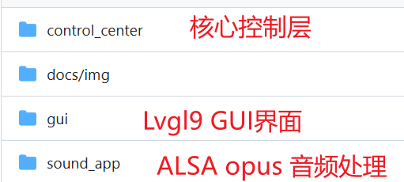
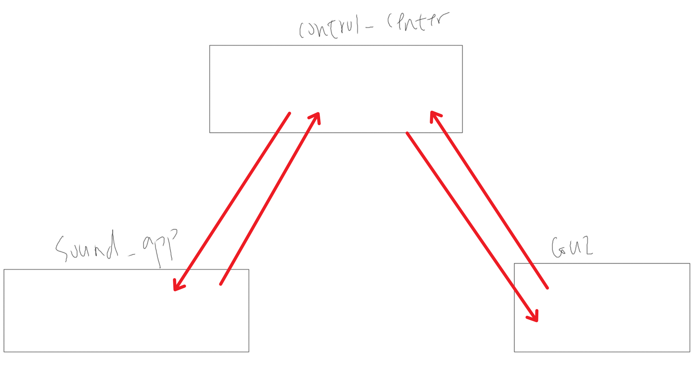
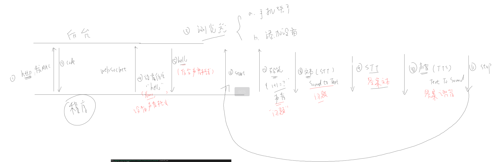
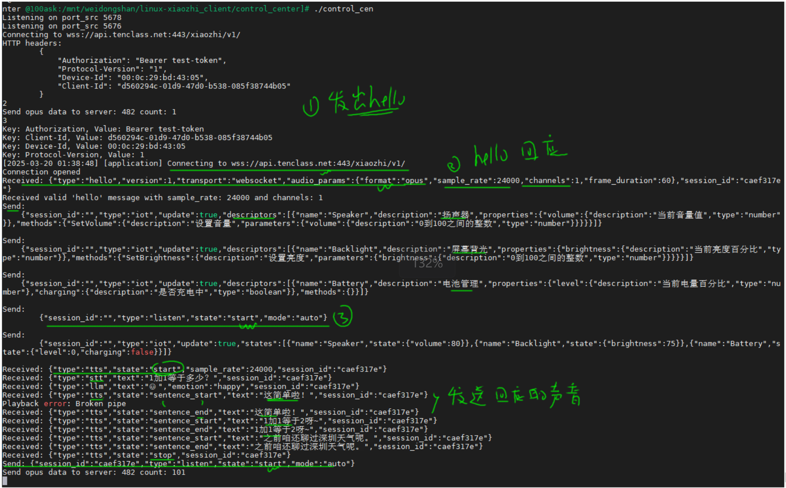
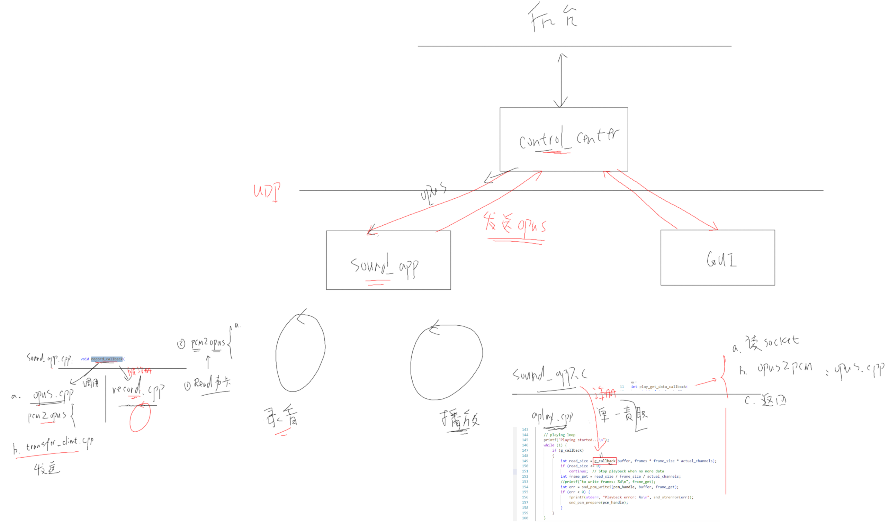
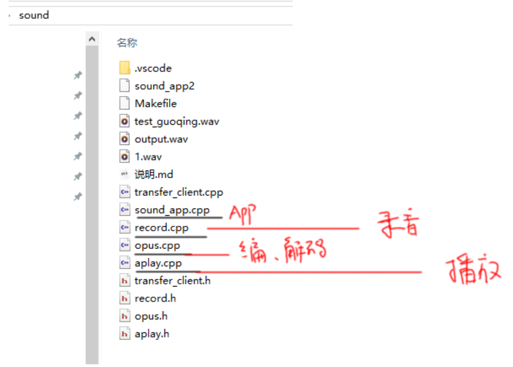
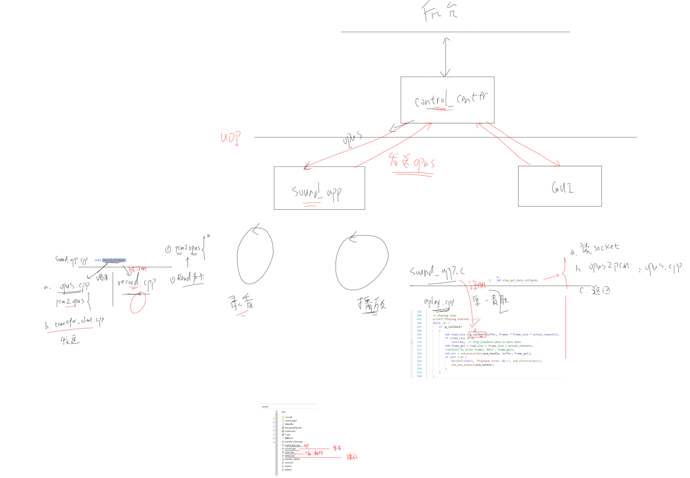
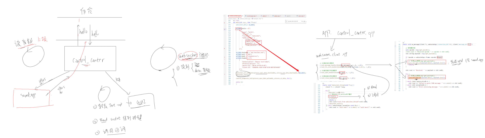
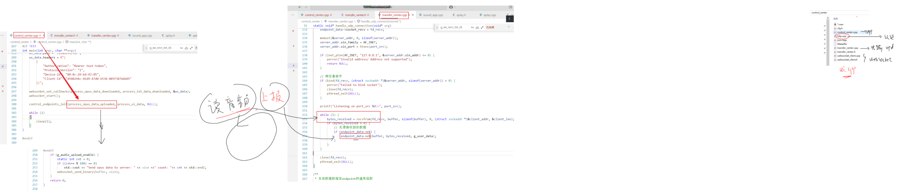

# Linux 小智 AI 聊天机器人

项目主要参考虾哥 [ESP32 AI小智](https://github.com/78/xiaozhi-esp32 ) 项目设计，我们在嵌入式 Linux 平台进行完整支持，其中有幸联系到虾哥本人，非常感谢在调试中给予我们建议方向，我们才能以最短的时间支持完成。此仓库主要作为 Linux AI小智 核心代码部分，不含各个单板平台适配相关的硬件 BSP 驱动 以及依赖，如果需要支持某款单板请参考如下支持列表。

目前支持单板平台 NXP IMX6ULL 平台，在支持 全志Tina T113 V85x系列平台 ， 嘉楠K230 ，以及RK 系列 STM32MP157 等平台  。 未来计划支持更多平台芯片以及开发板,欢迎感兴趣同学 提交 支持。

已支持硬件列表：
- DshanPIxCanMV K230 Buildroot24系统 : [DshanPI-CanMV](https://github.com/100askTeam/xiaozhi-linux-SupportList/tree/DshanPI-CanMV)
- 100ASK_T113s3-PRO Tina4系统 :  [100ASK_T113s3-Pro_Tina4](https://github.com/100askTeam/xiaozhi-linux-SupportList/tree/100ASK_T113s3-Pro_Tina4)
- 100ASK_T113s3-PRO Tina5系统： [100ASK-T113s3-Pro_Tina5](https://github.com/100askTeam/xiaozhi-linux-SupportList/tree/100ask-T113s3-Pro_Tina5)
- DongshanPI-AICT Tina4系统 ： [DongshanPI-AICT](https://github.com/100askTeam/xiaozhi-linux-SupportList/tree/DongshanPI-AICT)
- 100ASK_IMX6ULL-PRO Buildroot20系统 : [100ASK_IMX6ULL-PRO](https://github.com/100askTeam/xiaozhi-linux-SupportList/tree/100ASK_IMX6ULL-PRO)

提交贡献更多单板请参考: https://github.com/100askTeam/xiaozhi-linux-SupportList 内 README 

Linux 小智运行演示视频：https://www.bilibili.com/video/BV17nXNYJE5P/?share_source=copy_web&vd_source=695e352380e69504d9d46eb5e7463838

## 仓库介绍

源码主要结构：

源码架构解析：

- 小智接口流程概述

- sound_app框架分析

- control_center框架分析

## 提交贡献

此仓库目前只是保留 Linux AI小智部分源码，不含平台相关，欢迎大家 提交 issue PR 来帮助改进 Linux小智。

## 交流学习

QQ交流群：564992486 

AIOT边缘AI大模型开发课程：https://item.taobao.com/item.htm?id=901161273967

